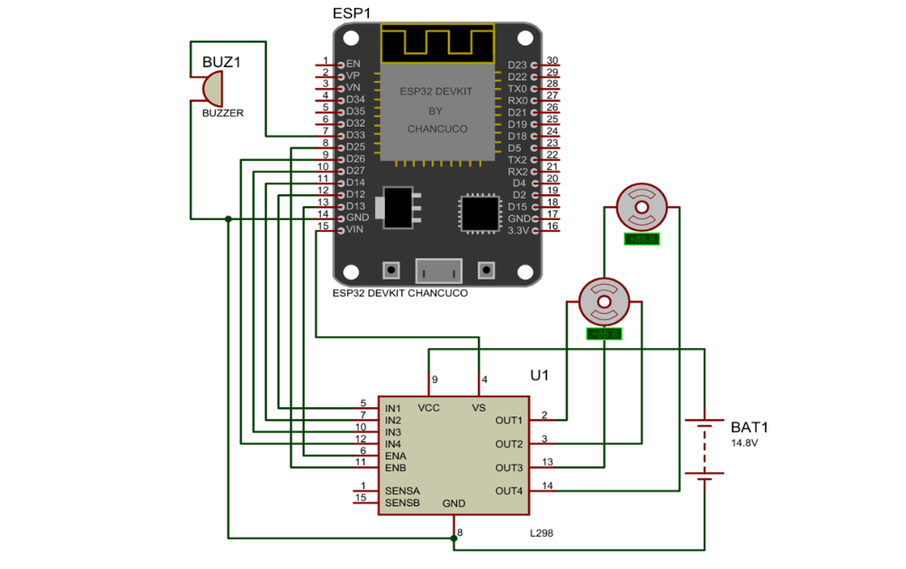

  

<h1 align="center">🤖 Bluetooth-Controlled Sumo Robot</h1>

  A high-performance ESP32-powered sumo robot engineered for competitive robotics, combining
  <strong>mechanical design</strong>, <strong>embedded systems</strong>, and
  <strong>engineering analysis</strong>.

---

# 📖 Overview

This project presents the design and development of a **Bluetooth-controlled sumo robot** built for competitive robotics. The robot was designed from the ground up with a strong emphasis on **high pushing force**, **rapid response**, **mechanical robustness**, and **efficient weight distribution**.

The system integrates an **ESP32 microcontroller**, a custom-designed mechanical chassis, wireless Bluetooth communication, and differential drive control. The engineering process included CAD modeling, embedded programming, power analysis, control system development, and simulation using industry-standard engineering software.

Beyond building a functional robot, this project demonstrates the complete engineering workflow—from concept and calculations to design validation, manufacturing, and real-world testing.

---

# 🚀 Project Highlights

- 🤖 ESP32-based embedded control system
- 📱 Bluetooth wireless control
- ⚙️ Differential drive architecture
- 📐 Custom Autodesk Inventor CAD design
- 🛡️ Lightweight low-profile wedge chassis
- 🔋 14.8V power system
- 📊 MATLAB & Simulink modeling
- 🔌 Electronic circuit simulation using Proteus
- 🧩 PCB and schematic design with KiCad
- 🏁 Designed for competitive sumo robotics

---

# 📊 Performance Summary

| Specification | Value |
|---------------|------:|
| Controller | ESP32 |
| Communication | Bluetooth |
| Drive System | Differential Drive |
| Battery | 14.8 V Li-ion |
| Estimated Push Force | ~52 N |
| Top Speed | ~0.14 m/s |
| Response Delay | <40 ms |
| Chassis | Custom CAD Design |

---

# 🖼️ Gallery

---
