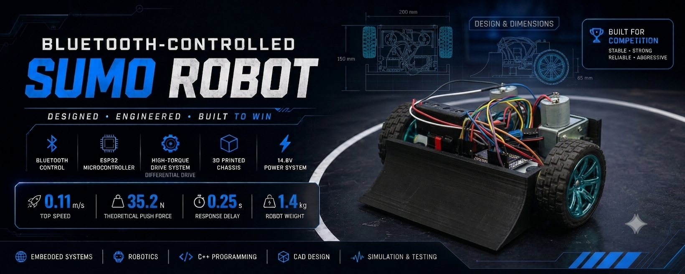
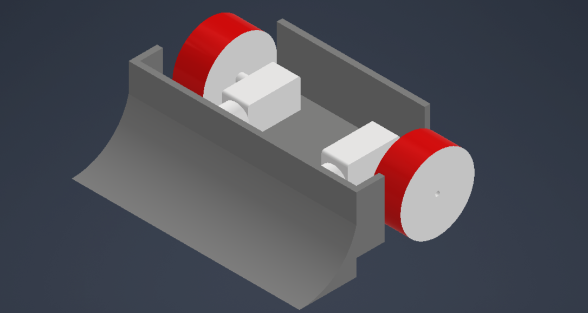
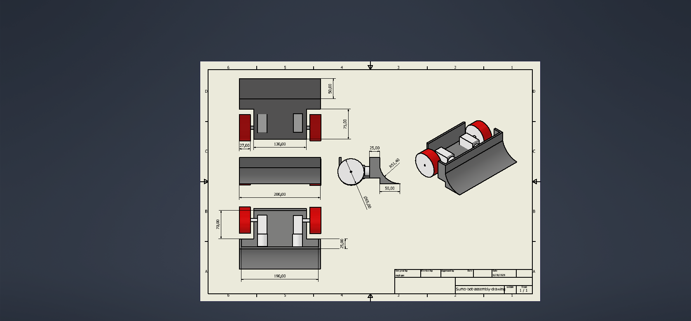
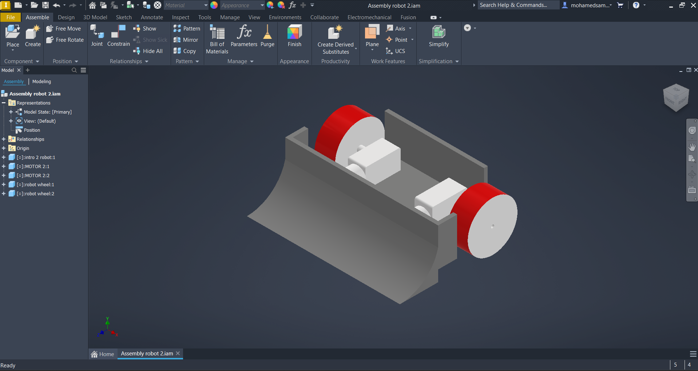
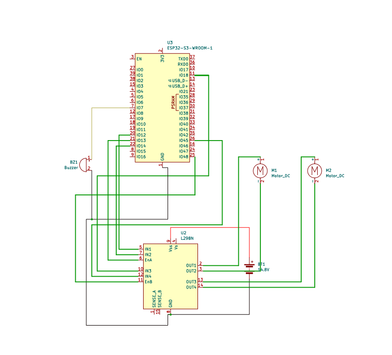
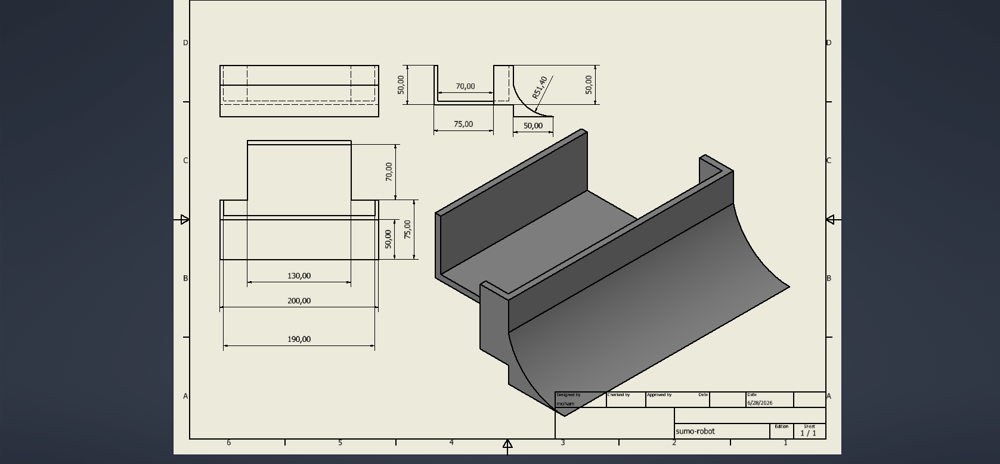
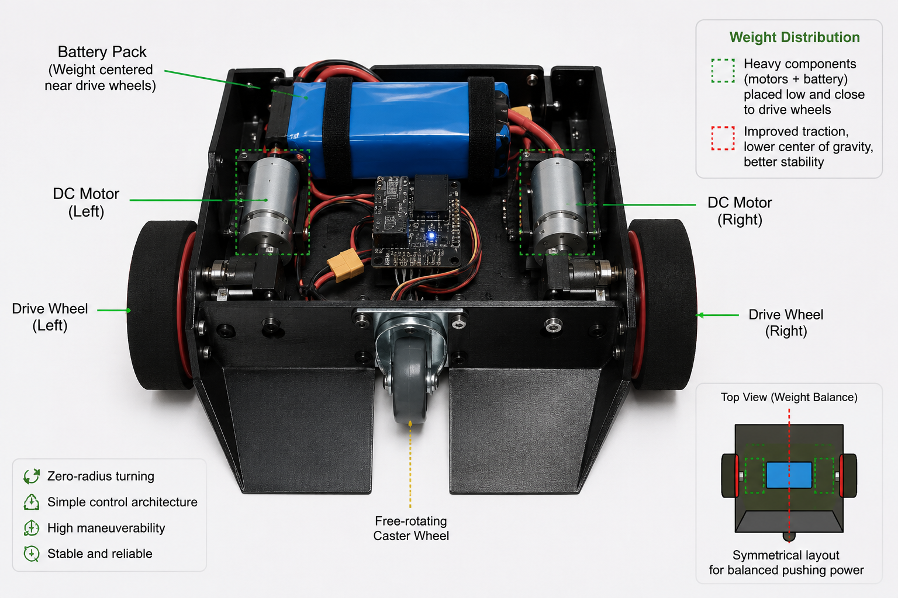
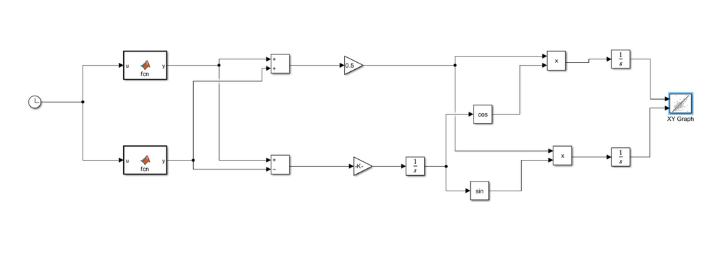
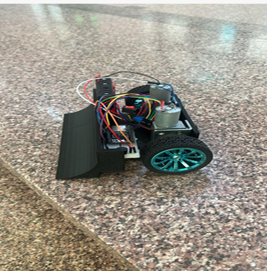

<p align="center">
    
</p>

<h1 align="center">🤖 Bluetooth-Controlled Sumo Robot</h1>

<p align="center">
A high-performance ESP32-powered sumo robot engineered for competitive robotics.<br>
Designed through a complete engineering workflow spanning mechanical design,
embedded systems, electronics integration, mathematical modeling, and system validation.
</p>

<p align="center">


</p>

---

## 📑 Table of Contents

- [Project Overview](#-project-overview)
- [Design Objectives & Requirements](#-design-objectives--requirements)
- [System Architecture](#️-system-architecture)
- [Mechanical Design](#️-mechanical-design)
- [Electronics Design](#-electronics-design)
- [Control System & Software](#-control-system--software)
- [Engineering Calculations](#-engineering-calculations)
- [CAD Gallery](#️-cad-gallery)
- [Simulation & Validation](#-simulation--validation)
- [Final Prototype & Specifications](#-final-prototype--specifications)
- [Results & Lessons Learned](#-results--lessons-learned)
- [Challenges & Engineering Decisions](#-challenges--engineering-decisions)
- [Future Improvements](#-future-improvements)
- [Repository Structure](#-repository-structure)
- [References](#-references)
- [Team](#-team)
- [License](#-license)

---

## 📖 Project Overview

Sumo robotics combines mechanical engineering, embedded systems, electronics, and control theory to build robots capable of pushing opponents out of a circular arena while maintaining stability, traction, and responsiveness.

This project was developed for the **Mechatronics Design** course at **Modern Sciences and Arts University (MSA University)**. Rather than treating the build as a programming exercise alone, the team followed a full engineering design process — concept development, analytical calculations, CAD modeling, electronics integration, firmware development, simulation, manufacturing, and experimental testing — to produce a fully functional Bluetooth-controlled sumo robot.

**Project summary:**

- **Controller:** ESP32, communicating wirelessly with a smartphone over Bluetooth
- **Locomotion:** Differential drive using two independently controlled DC motors
- **Chassis:** Low-profile wedge design that maximizes pushing capability
- **Workflow:** Mechanical CAD (Inventor) → circuit design (Proteus/KiCad) → firmware (Arduino) → analytical modeling (MATLAB/Simulink) → physical assembly and testing

The final prototype achieved stable wireless control, fast motor response, and competitive maneuverability, meeting all project design objectives.

---

## 🎯 Design Objectives & Requirements

The goal was to design and manufacture a compact, reliable, high-performance Bluetooth-controlled sumo robot. This translated into the following engineering targets:

| Requirement | Goal |
|--------------|---------|
| Bluetooth communication | Stable, low-latency link between phone and robot |
| Pushing force | Maximized without sacrificing stability |
| Center of gravity | Kept as low as possible |
| Footprint | Compact, arena-appropriate dimensions |
| Response time | Minimal delay between command and motion |
| Drive system | Reliable differential-drive control |
| Maintainability | Modular assembly for easy access/repair |
| Structure | Robust enough to withstand collision loads |

Every mechanical, electrical, and software decision in this project was evaluated against this table to keep the three subsystems working as one coherent mechatronic system.

---

## 🏗️ System Architecture

The robot is organized into four subsystems that map directly onto the signal/power flow from operator to motion:

```text
Smartphone → Bluetooth → ESP32 → Motor Driver → DC Motors → Robot Motion
```

| Subsystem | Contents |
|---|---|
| **Mechanical** | Custom CAD chassis, low-profile wedge, differential-drive wheel layout, optimized weight distribution |
| **Electrical** | ESP32 microcontroller, L298N motor driver, Li-ion battery pack, DC geared motors, Bluetooth module |
| **Software** | Arduino firmware, Bluetooth protocol handling, differential-drive control logic, PWM motor control |
| **Validation** | MATLAB calculations, Simulink modeling, Proteus circuit simulation, physical testing |

> 💡 **Engineering focus:** mechanical design, electronics, embedded programming, simulation, and validation were developed together — not bolted on sequentially — to produce a balanced, competitive platform.

---

## ⚙️ Mechanical Design

### Design Philosophy

Every mechanical component was chosen or shaped around three priorities: maximize pushing capability, keep the center of gravity low, and minimize weight without sacrificing rigidity.

### Chassis & Wedge

The chassis was modeled in **Autodesk Inventor** using a modular approach for easier manufacturing, assembly, and maintenance. Key considerations:

- Low-profile geometry that can slide underneath an opponent's chassis
- Compact footprint for maneuverability
- Symmetrical weight distribution
- Easy access to internal electronics
- Rigid construction to absorb impact loads

The front **wedge** — one of the most important parts on any sumo robot — is angled to lift the opponent's front wheels, reduce their traction, transfer pushing force efficiently into the chassis, and shield the robot from direct frontal impacts. The attack angle balances engagement against ground clearance during normal movement.

<p align="center">

</p>

> **Figure 1:** Complete CAD assembly of the Bluetooth-Controlled Sumo Robot.

<p align="center">

</p>

### Wheel Configuration & Weight Distribution

The robot uses a **differential-drive** layout: two independently driven DC motors with high-traction wheels, plus one free-rotating caster wheel. This gives zero-radius turning, a simple control architecture, and reliable navigation inside the arena.

Weight distribution is just as critical as the drivetrain itself. The battery pack sits close to the drive wheels to increase normal force on the tires (improving traction and pushing force), and the heaviest components — motors and battery — are mounted as low as possible to keep the center of gravity down and improve stability during aggressive pushing.

<p align="center">

</p>

> **Figure 2:** Exploded view of the mechanical assembly.

---

## 🔌 Electronics Design

The electrical system covers four functions: control, power, motor drive, and communication.

| Component | Function |
|------------|----------|
| ESP32 | Main controller — reads Bluetooth input, generates PWM, coordinates drive logic |
| L298N Motor Driver | Bidirectional, PWM-based dual H-bridge motor control |
| DC Geared Motors | Robot propulsion |
| Li-ion Battery Pack | Power supply |
| Bluetooth Module | Wireless link to smartphone |

```text
Smartphone → Bluetooth → ESP32 Controller → L298N Motor Driver → Battery-supplied Motors
```

**ESP32:** chosen for its built-in Bluetooth, ample processing headroom, low power draw, multiple PWM outputs, and mature Arduino ecosystem support. It handles Bluetooth command parsing, PWM generation, motor direction control, and differential-drive coordination.

**Motor driver (L298N):** provides bidirectional control, PWM speed regulation, independent left/right channels, and high-current switching for both motors.

**Power system:** a rechargeable Li-ion pack sized to deliver stable voltage and sufficient current under heavy motor load, including the high startup current draw typical of DC motors. Sizing was checked analytically before parts were ordered (see [Engineering Calculations](#-engineering-calculations)).

**Circuit design:** the control circuit was first built and verified in **Proteus** to validate wiring and motor-control logic, then the schematic and PCB layout were finalized in **KiCad**.

<p align="center">

</p>

> **Figure 3:** Electrical schematic of the control system.

---

## 🧠 Control System & Software

### Differential Drive Logic

The operator sends movement commands from a smartphone app over Bluetooth. The ESP32 parses each command and generates the matching PWM signals for the left and right motors:

| Left Motor | Right Motor | Resulting Motion |
|------------|-------------|---------|
| Forward | Forward | Forward |
| Reverse | Reverse | Backward |
| Forward | Reverse | Rotate right |
| Reverse | Forward | Rotate left |
| Stop | Stop | Stop |

### Firmware Architecture

Built in the **Arduino IDE** with a modular structure for readability, debugging, and future expansion:

```text
Initialize hardware → Connect Bluetooth → Receive command →
Process input → Generate PWM → Drive motors → Wait for next command
```

**Key features:**
- Wireless Bluetooth operation with low-latency response
- Differential-drive control algorithm
- PWM-based motor speed control
- Non-blocking firmware structure to keep communication responsive
- Modular code, ready for autonomous-navigation features later

---

## 📐 Engineering Calculations

Before any manufacturing began, the team ran the analytical work needed to size components correctly rather than relying on trial and error:

- Motor torque estimation
- Pushing-force analysis
- Robot velocity estimation
- Battery capacity and power-consumption calculations
- Differential-drive kinematics

These results directly drove the choice of motors, gear ratio, battery capacity, and overall mechanical layout. Full derivations are in **[`docs/Project_Report.pdf`](docs/Project_Report.pdf)**.

---

## 🖼️ CAD Gallery

The full robot was modeled in **Autodesk Inventor** before any physical fabrication, allowing the team to check component placement, weight distribution, assembly constraints, and manufacturability up front.

<p align="center">

</p>

> **Figure 4:** Complete CAD assembly.

<p align="center">

</p>

> **Figure 5:** Chassis design — built for rigidity, low weight, and easy maintenance.

<p align="center">

</p>

> **Figure 6:** Internal electronics layout — planned to reduce cable clutter, improve accessibility, and keep weight balanced.

---

## 🧪 Simulation & Validation

### MATLAB & Simulink

Used to model the robot's dynamic behavior — differential-drive kinematics, motion response, and velocity estimation — and to cross-check the hand calculations above.

<p align="center">

</p>

> **Figure 7:** Simulink model used for system analysis.

### Proteus Simulation

The electronic control system (motor driver behavior, ESP32 control logic, wiring) was validated in **Proteus** before any hardware was assembled, catching circuit issues early and reducing rework.

<p align="center">

</p>

> **Figure 8:** Proteus simulation of the electronic system.

---

## 🤖 Final Prototype & Specifications

After design, simulation, and validation were complete, the robot was manufactured and assembled into a fully functional prototype integrating all mechanical, electrical, and software subsystems.

<p align="center">

</p>

> **Figure 9:** Final assembled robot.

| Specification | Value |
|--------------|------:|
| Controller | ESP32 |
| Drive System | Differential drive |
| Communication | Bluetooth |
| Battery | 14.8V Li-ion |
| Motor Driver | L298N |
| Chassis | 3D printed |
| CAD Software | Autodesk Inventor |
| Simulation | MATLAB / Simulink |
| Circuit Validation | Proteus |
| **Top Speed** | **0.11 m/s** |
| **Theoretical Push Force** | **35.2 N** |
| **Response Delay** | **0.25 s** |
| **Robot Weight** | **1.4 kg** |

---

## 📊 Results & Lessons Learned

### Achievements

- ✅ Stable Bluetooth communication with low latency
- ✅ Responsive, stable differential-drive motion
- ✅ Compact, lightweight chassis with good traction
- ✅ Reliable electronic integration under motor load
- ✅ Simulation results consistent with physical testing

### Lessons Learned

- Mechanical and electrical systems need to be designed together, not in isolation — chassis geometry directly affects power and traction needs.
- Weight distribution has an outsized effect on pushing performance and stability.
- Simulating before manufacturing catches design errors early and saves rework.
- A modular firmware architecture made debugging and later changes much easier.
- Doing the analytical calculations up front, rather than after building, improved reliability and cut development time.

<p align="center">

| CAD Design | Prototype |
|------------|-----------|
|  |  |

</p>

---

## 🚧 Challenges & Engineering Decisions

**Weight vs. traction:** more weight improves traction and pushing force but increases demands on motors and battery. The team kept the chassis lightweight overall while concentrating mass directly above the drive wheels — getting traction benefits without the full weight penalty.

**Center of gravity:** an elevated CG hurts stability during pushing contests. Mounting the battery and motors low and distributing mass symmetrically kept the robot stable during aggressive maneuvers.

**Startup current:** DC motors draw far more current at startup than during steady-state operation, so the battery and motor driver had to be sized for peak draw, not average draw, to guarantee reliable starts and stable voltage.

**Bluetooth responsiveness:** keeping the link responsive while continuously updating motor outputs required non-blocking firmware that avoids delays in the main control loop.

**Key decisions:**
- Differential drive chosen for simplicity and maneuverability over more complex steering systems
- ESP32 chosen specifically for integrated Bluetooth (avoiding a separate wireless module)
- CAD-first workflow adopted to catch manufacturing issues before cutting material
- Simulation completed before assembly to validate behavior ahead of physical testing

---

## 🚀 Future Improvements

| Area | Planned Enhancements |
|---|---|
| **Mechanical** | Aluminum/carbon-fiber chassis, improved wheel materials, adjustable wedge geometry, further weight reduction |
| **Electronics** | Custom PCB, higher-efficiency motor driver, battery monitoring, integrated voltage regulation |
| **Software** | PID speed control, closed-loop motor feedback, automatic braking, configurable drive modes |
| **Autonomy** | Ultrasonic/IR sensors, computer vision, line detection, obstacle avoidance, ROS 2 integration, autonomous opponent detection |

---

## 📁 Repository Structure

```text
bluetooth-controlled-sumo-robot
│
├── README.md
├── LICENSE
│
├── cad/
│   ├── MOTOR.dwg
│   ├── MOTOR.ipt
│   ├── robot-wheel.dwg
│   ├── robot-wheel.ipt
│   ├── Sumo-bot-assembly-drawing.dwg
│   ├── sumo-robot-body.ipt
│   └── sumo-robot.dwg
│
├── electronics/
│   ├── schematic.pdf
│   └── wiring.png
│
├── firmware/
│   ├── code/
│   ├── sumo-bot-code.ino
│   └── bluetooth-controlled-sumo-robot-simulink.slx
│
├── images/
│   ├── hero-banner.png
│   ├── cad-render.png
│   ├── chassis.png
│   ├── internala-layout.png
│   ├── MOTOR.png
│   ├── proteus.png
│   ├── robot-assembly-cad-pic.png
│   ├── robot-wheel.png
│   ├── robot.png
│   ├── schematic.png
│   ├── simulink.png
│   └── Sumo-bot-assembly-drawing.png
│
└── docs/
    └── Project_Report.pdf
```

| Directory | Description |
|-----------|-------------|
| `cad/` | Autodesk Inventor parts and drawing files |
| `electronics/` | Schematic (PDF) and wiring diagram |
| `firmware/` | ESP32 Arduino code and Simulink model |
| `images/` | CAD renders, prototype photos, and diagrams |
| `docs/` | Project report and supporting calculations |

---

## 📚 References

- ESP32 Technical Documentation
- Arduino Documentation
- Autodesk Inventor Documentation
- MATLAB & Simulink Documentation
- KiCad Documentation
- Proteus Documentation

Full derivations and design methodology are documented in **[`docs/Project_Report.pdf`](docs/Project_Report.pdf)**.

---


## 📄 License

Released under the **MIT License** — see [LICENSE](LICENSE) for details.

---

## ⭐ Support

If this project was useful or interesting:

- ⭐ Star this repository
- 🍴 Fork it and build your own version
- 💡 Open an issue with feedback or questions
- 🤝 Connect on LinkedIn

<p align="center">

### Built with ❤️ by Mohamed Samer
**Mechatronics Engineering Student** · Modern Sciences and Arts University (MSA University)

</p>
